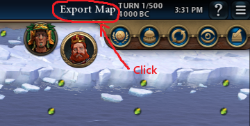

A mod intended for **VANILLA** Civilization VI to export map data to the lua.log file. It might work with dlcs, but that is not supported.        
**Must install [the gui tool](https://github.com/DarrelTran/civdist-gui.git) first to convert the lua.log data to a .json file. This .json is intended to be used with [CivDist](https://github.com/DarrelTran/civdist.git) to load the map.**

# How to install and use:
1. Download the latest relase of the mod and the gui tool. Follow the instructions on [the gui tool's page](https://github.com/DarrelTran/civdist-gui.git) to learn how to install it.
2. Extract the folder to Documents/My Games/Sid Meier's Civilization VI/Mods and enable the mod in-game. 
3. After loading a map in-game, near the top right and above the leader icons, click the 'Export Map' button. (See [Export Map button location](#export-map-button-location))
4. Wait a couple seconds for the data to output. If the map is very large, there will be a noticable freeze, but just wait until the freeze is gone.
5. Open the [the gui tool](https://github.com/DarrelTran/civdist-gui.git).
6. Point the input box to your lua.log file (typically in AppData/Local/Firaxis Games/Sid Meier's Civilization VI/Logs/Lua.log).
7. Set the output to whatever you like. You can add a \fileName.json to the end of your output path to specify the file name. Otherwise, it defaults to civJSON.json.
8. Press the 'Start' button and it should popup a success message with your .json file ready.

# Export Map button location:

